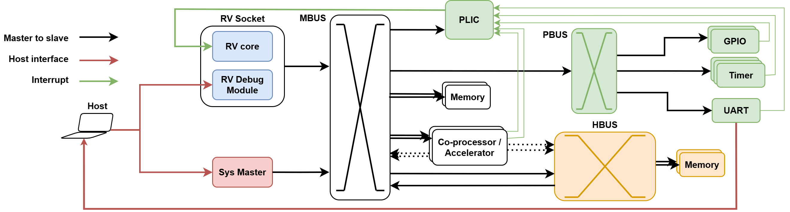

# The Simply-V Framework

Simply-V is a flexible and extensible soft-SoC generator platform for Xilinx FPGAs from the University of Naples Federico II.

Designed for rapid prototyping and open hardware research, Simply-V enables plug-and-play support for multiple CPUs, IPs and accelerators, offers structured configurability across embedded and high-performance profiles, and supports the integration of both RTL and HLS-based components, alongside automatic clock-domain crossing and frequency scaling.

## Environment and Tools Version
This project was verified on Ubuntu 22.04 and the following tools version:
| Tool            | Verified version |
|-----------------|------------------|
| Vivado          | 2024.2           |
| Vivado          | 2023.1           |
| Vivado          | 2022.2           |
> `CORE_MICROBLAZEV*` are supported only in Vivado >= 2024.2.

## SoC Profiles
The SoC comes in two flavors, `hpc` and `embedded` profiles, and support for multiple boards.

Supported boards and associated profiles are:

| Profile                  | Board
|--------------------------|--------------------------
| `embedded` (Default)     | [Nexys A7-100T](https://digilent.com/reference/programmable-logic/nexys-a7/reference-manual) (Default)
| `embedded`               | [Nexys A7-50T](https://digilent.com/reference/programmable-logic/nexys-a7/reference-manual)
| `hpc`                    | [Alveo U250](https://www.amd.com/en/products/accelerators/alveo/u250/a-u250-a64g-pq-g.html) (Default)
| `hpc`                    | [Alveo U280](https://docs.amd.com/r/en-US/ug1314-alveo-u280-reconfig-accel)

> **NOTE:** To use the Alveo U280, Vivado <= 2023.1 is needed because the Alveo U280 is EOL (end of life)

Further support is coming soon for:
- [Zybo](https://digilent.com/reference/programmable-logic/zybo/reference-manual)
- [ZCU102](https://www.xilinx.com/products/boards-and-kits/ek-u1-zcu102-g.html)
- [Alveo U50](https://docs.amd.com/r/en-US/ug1371-u50-reconfig-accel)


## Quick Start:
The top-level `Makefile` can be used to build the platform for the specific target board.

First, setup environment with:
``` bash
source settings.sh <SIMPLYV_PROFILE> <board>
```
> NOTE: If no input parameter is specificed, we default to `embedded` profile and the Nexys A7-100T board.

### Build Hardware and Software

Build defaults with:

``` bash
make all
```

Alternatively, you can control the individual steps.

1. Configure the SoC:
``` bash
make config # This is always called when operating from the top Makefile
```

2. Download rtl sources for third-party modules:
``` bash
make units
```

3. Build the SoC bitstream by running:
``` bash
make xilinx
```

4. Build software examples with:
``` bash
make sw
```

### Run Software

5. Program device:
``` bash
make -C hw/xilinx program_bitstream
```

6. Start serial terminal:

For `embedded` profile, use a TTY emulator, e.g. screen or minicom.
For `hpc` profile, launch our [virtual UART emulator](sw/host/virtual_uart/README.md).
``` bash
sudo sw/host/virtual_uart/bin/virtual_uart <PCIE_BAR + Virtual UART offset>
```

7. Start GDB

Start GDB backend OpenOCD or XSDB:
``` bash
make -C hw/xilinx xsdb_run # for Microblaze-V
make -C hw/xilinx openocd_run # for other cores
```

In a new shell, start GDB frontend and run example until completion:
``` bash
make -C hw/xilinx gdb_run EXAMPLE=hello_world
```

### Documentation Index

Fine-grained documentation and insights to control the building flow, can be found below:
1. [Configuration flow](config/README.md): re-configure Simply-V.
2. Hardware build:
   - [Hardware units](hw/units/README.md): prepare external custom IPs.
   - [Xilinx FPGA](hw/xilinx/README.md): package IPs, build bitstream, program device and debug platform.
3. [Software build](sw/README.md): build software for Simply-V.
   - [Run software](hw/xilinx/doc/PROGRAM_LOADING.md): additional doc for loading programs.
4. Simulation (TBD):
   * Unit tests: Verilator
      * Royalty-free, good for students
      * No support for Xilin IPs
   * SoC-level tests, QuestaSim:
      * Requires license
      * Supports Xilinx IPs
      * Students can access a licensed host for simulator access

## Architecture

In both `hpc` and `embedded` profiles, the SoC architecture and host connection is depicted below:



The host connects to a RISC-V debug module through JTAG and a `Sys Master` AXI master module, allowing for direct control and read-back over the main bus.

### Profiles:
Simply-V supports the following profiles `embedded` and `hpc`.

Physical resources depend on the target board and part number. W.r.t. the default supported boards and pre-configured CSVs, the platform offers:
- Profile `embedded` on Nexys-A7-100T:
   - UART: physical peripheral requires a [physical FTDI connection](hw/xilinx/doc/UART_CONNECTION.md)
   - Memory: 64 KB BRAM
   - `Sys Master`: through JTAG Xilinx `hw_server`
- Profile `hpc` on Alveo U250:
   - UART: virtualized over PCIe.
   - Memory: 64 KB BRAM + 2x 16 GB DDR4
   - `Sys Master`: through PCIe BAR addres space.

## Citation
When using or referencing Simply-V in your work, please use the following:

Full paper in ACM TODAES:
```
@article{10.1145/3787500,
   author = {Maisto, Vincenzo and Mercogliano, Stefano and Maddaluno, Manuel and Cilardo, Alessandro},
   title = {The Simply-V Framework: an Extensible RISC-V Reconfigurable Soft-SoC for Open Research and Fast Prototyping},
   year = {2026},
   publisher = {Association for Computing Machinery},
   address = {New York, NY, USA},
   issn = {1084-4309},
   url = {https://doi.org/10.1145/3787500},
   doi = {10.1145/3787500},
   note = {Just Accepted},
   journal = {ACM Trans. Des. Autom. Electron. Syst.},
   month = jan,
   keywords = {RISC-V, FPGA, Fast-Prototyping, Experimental Research.}
}
```

Short paper at Euromicro DSD 2025:
```
@article{Maisto_Mercogliano_Maddaluno_Cilardo_2025,
   title={Simply-V: A RISC-V Reconfigurable Playground Soft-SoC for Open Hardware Research and Fast Prototyping},
   volume={11},
   url={https://www.wipiec.digitalheritage.me/index.php/wipiecjournal/article/view/86},
   DOI={10.64552/wipiec.v11i1.86},
   number={1},
   journal={WiPiEC Journal - Works in Progress in Embedded Computing Journal},
   author={Maisto, Vincenzo and Mercogliano, Stefano and Maddaluno, Manuel and Cilardo, Alessandro}, year={2025}, month={Sep.}, pages={4}
}
```
