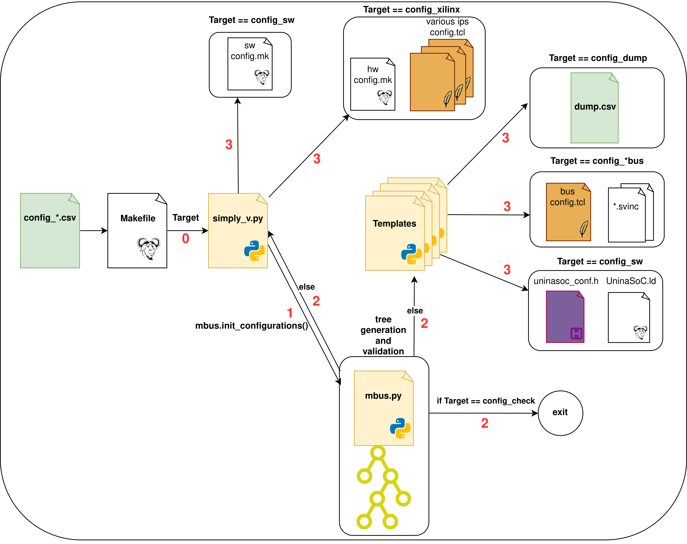

# Simply-Config: Configuration and Generation Framework for Simply-V
This tree allows for the automatic generation of the AXI crossbar IP and linker script for software development.

## Prerequisites and Tools versions
This tree has been verified with the following tools and versions:
* Vivado 2022.2 - 2024.2
* AXI Interconnect v2.1
* Python >= 3.10

##  Configuration file format
The input configuration files are CSV files. These files are under the configs directory structured as follows:
``` bash
configs
├── common                           # Config files shared between hpc and embedded
│   └── config_system.csv            # System-level configurations
├── embedded                         # Config files for embedded
│   ├── config_mbus.csv              # MBUS config file
│   └── config_pbus.csv              # PBUS config file
└── hpc                              # Config files for hpc
    ├── config_mbus.csv              # MBUS config file
    ├── config_hbus.csv              # HBUS config file
    └── config_pbus.csv              # PBUS config file
```

A configuration file can either refer to system-level options or to a specific bus. For now only MBUS, PBUS and HBUS are supported, **but file names must match those above**.

In each file, each row of the file holds a property name and value pair.
Some properties are array, with elements separated by a white space " " character.

The following table details the supported properties.

### System Configuration

> **IMPORTANT NOTE**: XLEN parameter will only affect main bus sizes. Other buses (such as the peripheral bus) will have a hardcoded DATA_WIDTH and ADDRESS_WIDTH value.

| Name  | Description | Values
|-|-|-|
| CORE_SELECTOR         | Select target RV core       | CORE_PICORV32, CORE_CV32E40P, CORE_IBEX, CORE_MICROBLAZEV_RV32, CORE_DUAL_MICROBLAZEV_RV32, CORE_MICROBLAZEV_RV64, CORE_CV64A6, CORE_CV64A6_ARA
| VIO_RESETN_DEFAULT    | Select value for VIO resetn | [0,1]
| XLEN                  | Defines Bus DATA_WIDTH, supported cores and Toolchain version | [32,64]
| PHYSICAL_ADDR_WIDTH $^1$| Select the phyisical address width. If XLEN=32 it must equal 32. If XLEN=64, it must be > 32 | (32..)
| BOOT_MEMORY_BLOCK     | Select memory device to use for boot | [BRAM_\<n\>, DDR4CH_\<n\>]
| MAIN_CLOCK_DOMAIN     | Clock domain of the core + MBUS                           | (10, 20, 50, ) for embedded. (10, 20, 50, 100, ) for hpc
> $^1$ For `embedded` profile, due to limitations in the JTAG to AXI Master IP [PG174](https://docs.amd.com/v/u/en-US/pg174-jtag-axi), PHYSICAL_ADDR_WIDTH allowed values are only [32,64].


### Notes for CORE_SELECTOR
**XLEN** configuration must match the selected `CORE_SELECTOR`:
- `XLEN=64` requires `CORE_SELECTOR in {CORE_MICROBLAZEV_RV64, CORE_CV64A6}`
- `XLEN=32` requires `CORE_SELECTOR in {CORE_PICORV32, CORE_CV32E40P, CORE_IBEX, CORE_MICROBLAZEV_RV32, CORE_DUAL_MICROBLAZEV_RV32}`

Additional notes:
- `CORE_SELECTOR = CORE_PICORV32`: the external PicoRV32 IP is currently bugged in CSR support. Any code running with CORE_PICORV32 must not perform any CSR operation.
- `CORE_SELECTOR = CORE_DUAL_MICROBLAZEV_RV32` requires two additional `MASTER_NAMES` into `config_main_bus.csv`, namely `RV_SOCKET_DATA1 RV_SOCKET_INSTR1`.
- `CORE_SELECTOR = CORE_CV64A6_ARA` supports a maximum MAIN_CLOCK_DOMAIN frequency of 50 MHz.

### VIO resetn default
The `VIO_RESETN_DEFAULT` parameter controls the programming-time value of core reset.
- `VIO_RESETN_DEFAULT = 1` (default): VIO resetn is non-active, the CPU starts running at programming-time, allowing debugging with DTM and GDB.
- `VIO_RESETN_DEFAULT = 0`:  VIO resetn is active, keeping the core in a reset state when the bitstream is programmed.

### Bus Configuration

> **IMPORTANT NOTE**: the address range of a bus (child) that is a slave of another bus (parent), in its configuration (.csv) file, must be an absolute address range, this means that if the child bus is mapped in the parent bus at the address 0x1000 to 0x1FFF, then the peripherals in the child bus must be in the address range 0x1000 to 0x1FFFE

| Name  | Description | Values
|-|-|-|
| PROTOCOL              | AXI PROTOCOL                                              | (AXI4, AXI4LITE, AXI)
| LOOPBACK     | [`Full description here`](./doc/loopback.md) (NonLeafBus only)                           | [0,1]
| ID_WIDTH              | AXI ID Width                                              | (4..)
| MASTER_NAMES          | Names of masters connected to the bus                     | (0..) Strings
| RANGE_NAMES           | Names of slave memory ranges                                               | (0..) Strings
| RANGE_CLOCK_DOMAINS$^1$ | Clock domains of the slaves (RANGE_NAMES) of the MBUS | [NUM_MI] (10, 20, 50, 100, 250 (hpc only))|
| ADDR_RANGES           | Number of ranges for master interfaces                    | (1..)
| BASE_ADDR             | The Base Addresses for each range of each Master          | [NUM_MI*ADDR_RANGES] 64 bits hex
| RANGE_ADDR_WIDTH      | Number of bytes covered by each range of each Master      | [NUM_MI*ADDR_RANGES] (12..) for AXI4 and AXI3, (1..) for AXI4LITE
> $^1$ BRAM, DM_mem, CLINT, PLIC clock domainS must be the same as MAIN_CLOCK_DOMAIN, while the DDR clock domain must have the same frequency of the DDR board clock (i.e. 300MHz)

> \**: AXI Crossbar (PG) uses an opaque THREAD_ID_WIDTH parameter to track transaction ordering alongside ID_WIDTH.
Hence, the ID_WIDTH parameter requires to accommodate the Master ID plus the maximum THREAD_ID_WIDTH value, i.e. [ceil_log2(NUM_SI) + max(THREAD_ID_WIDTH)].


## Genenerate Configurations
After applying configuration changes to the target CSV files (`embedded` or `hpc`), apply though `make`.

Alternatively, you can control the generation of single targets:
``` bash
$ make config_check               # Preliminary sanity check for configuration
$ make config_mbus                # Generates MBUS config
$ make config_pbus                # Generates PBUS config
$ make config_hbus                # Generates HBUS config
$ make config_sw                  # Update software config
$ make config_xilinx              # Update xilinx config
$ make config_dump                # Generates peripherals reachability dump
$ make all                        # Generates all the hw and sw configuration files
$ make help                       # Retrieve Makefile targets information and python application cmd help
```

### BRAM size DDR4 cache configuration and UART clk frequency
The `config_xilinx` flow also configures:
- the BRAM size of the IP `xlnx_bram_<i>` (where i is the BRAM index) according to the `RANGE_ADDR_WIDTH` assigned to the BRAM in the CSV.
- the cache base and end address of the IP `xlnx_system_cache_ddr4ch<i>` (where i is the DDR4 channel on which the cache is configured) assigned to the `DDR4CH_<i>` in the CSV.
- the clock frequency of the UART in the IP `xlnx_axi_uartlite` based on the clock domain assigned to the `PBUS` in the CSV.

> **NOTE**: The `xlnx_bram_0/config.tcl` file configures the first BRAM occurrence, hence it uses the index 0. If multiple BRAMs are declared in the config (CSV) file, they MUST be specified with different indexes according to the [Naming convention](./doc/names.md), the same applies to DDR4 channels caches.

> **NOTE**: All the `xlnx_bram_<i>/config.tcl` configuration files must be in the `ips/common` directory.

### Clock domains
The configuration flow gives the possibility to specify clock domains.
The `MAIN_CLOCK_DOMAIN` is the clock domain of the core and the main bus (`MBUS`). All the slaves attached to the `MBUS` can have their own clock domain. If a slave has a domain different from the `MAIN_CLOCK_DOMAIN`, it needs a `xlnx_axi_clock_converter` to cross the clock domains. In this case the configuration flow will set the `<SLAVE_NAME>_HAS_CLOCK_DOMAIN` (i.e. `PBUS_HAS_CLOCK_DOMAIN`) variable which informs that the slave has its own clock domain.

### Configuration Architecture
The directory `simply_config/` holds all the configuration related files, the main configuration flow is depicted here:



The generation flow can be summarized as follows:

1. **Config checking**
    The *config_check* flow used to validate the configurations expressed in the .csv files (that is also the precondition for each of the other
    configuration flows) starts with [`mbus.init_configurations()`](simply_config/buses/mbus.py) that is the starting point for the creation of the
    tree hierarchy and for all the checks and sanitizations of the inputs.
    The configuration flows use the class hierarchy [`Parsers`](simply_config/parsers) to parse and sanitize the input csv and the class hierarchy
    [`Factories`](simply_config/factories) to centralize the objects creation.

2. **Software configuration flow (`config_sw`)**
   The entire software side is produced by the *config_sw* flow. In particular:
   - The software Makefile is generated by [`simplyv.update_sw_makefile()`](simply_config/general/simplyv.py).
   - The [Linker script](../sw/SoC/common/simplyv.ld) is generated from [`ld_template.py`](simply_config/templates/ld_template.py).
   - The HAL header file is generated from [`halheader_template.py`](simply_config/templates/halheader_template.py).

3. **Xilinx-related configuration**
   All Xilinx-specific configuration of the *config_xilinx* flow is handled directly by the following functions:
   - [`simplyv.config_xilinx_makefile()`](simply_config/general/simplyv.py)
   - [`simplyv.config_xilinx_clock_domains()`](simply_config/general/simplyv.py)
   - [`simplyv.config_peripherals_ips()`](simply_config/general/simplyv.py)

4. **Bus-related configuration**
   All bus-related files (*config_bus* flow) are generated by:
   - [`crossbar_template.py`](simply_config/templates/crossbar_template.py)
   - [`bus_interconnect_template.py`](simply_config/templates/bus_interconnect_template.py)
   - [`clocks_template.py`](simply_config/templates/clocks_template.py)

5. **Peripheral dumping**
   The generation of peripheral dumps for the *config_dump* flow is handled by [`dump_template.py`](simply_config/templates/dump_template.py).

### How to add a new property
In the table above, multiple properties are supported, but more can be added. To add a new property:

1. In the target CSV file, e.g. `config_mbus.csv`, add the new key-value pair.
2. In file `buses/bus.py` or `general/simplyv.py` (depending on where you're adding the property), add the new property to the class. Name must match the key in the `.csv` file.
3. In one of the parser classes file, depending if the property is system o bus specific (NonLeaf or Leaf) add the new rules for parsing and validations, following the [`parser.py`](simply_config/parsers/parser.py) design expressed in the header file.

### How to add a new Bus

For a guide on how to add a new bus in the configuration flow refer to [`Adding a New Bus to the System`](./doc/bus.md)

### Configuration flow Class Diagrams

The bash script [`docs.sh`](simply_config/docs.sh) uses Pyreverse to automatically generate class diagrams
of all the Python classes in the configuration flow and is suited to have a quick reference when modifying the
actual configuration flow implementation.

How to install the dependencies needed to run the script:
``` bash
pip install pylint
sudo apt install graphviz
```
A more structured and precise reference is in the [`doc`](doc) folder,
that need to be manually kept up to date when changing the code modifying the PlantUML code accordingly.
