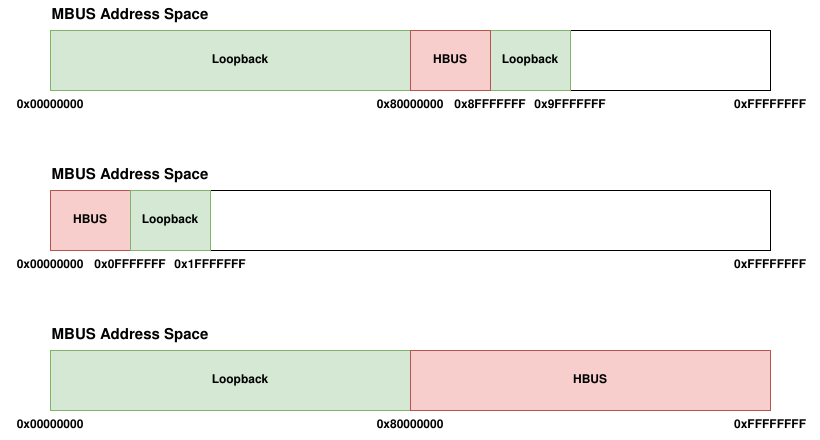

# NonLeafBus LOOPBACK Feature

## Overview

The `NonLeafBus` class supports the **LOOPBACK** feature, allowing a bus to act as both a master and a slave by routing transactions back to its father bus.

Enabling LOOPBACK requires coordination between the **activating bus (child)** and its **father bus**.

The child bus will access its father address space creating new `BEFORE` and `AFTER` ranges covering the addressing space before and after its own on the father bus.

---

## Constraints

A `NonLeafBus` can activate LOOPBACK only if all the following conditions are met:

- The activating `NonLeafBus` **must have a father bus**  
  - Only the `MBUS` has no father bus and therefore cannot activate LOOPBACK.
- `RANGE_BASE_ADDR` must be:
  - Equal to **0**, or
  - A **power of 2**
- `ADDR_RANGES` must be equal to **1**.  

Furthermore the `AFTER` address range will be limited to the same `ADDR_WIDTH` or `ADDR_WIDTH + 1` of the activating bus address range, according to what described in the **Rationale** section.

---

## LOOPBACK Activation

When the LOOPBACK feature is enabled, **two functions are invoked**:

- `_father_enable_loopback`
- `_child_enable_loopback`

The `_father_enable_loopback` function performs the following actions on the father bus:

- Adds the child bus `FULL_NAME` to the `MASTER_NAMES` list
- Increments by 1 the `NUM_SI` value specified by the user in the father bus .csv file

This allows the father bus to support the new master connection coming from the child.

The `_child_enable_loopback` function performs the following actions:

To support LOOPBACK, the child bus will add a slave interface (incrementing by 1 the `NUM_MI` value specified by the user in the child bus .csv file).

Then three different behaviours are possible depending on the position of the `child` bus inside its `father` address space:
  - The bus is in the first address range of the father bus (`base address of child equals to base address of father`)
  - The bus is in the last address range of the father bus (`end address of child equals to end address of father`)
  - The bus is in an arbitrary middle address range of the father bus

In the first case the child bus will use the new added slave interface to address the address space on its father `AFTER` its own address space.

In the second case the child bus will use the new added slave interface to address the address space on its father `BEFORE` its own address space.

In the third case the child bus will use the new added slave interface to address both the address space on its father `BEFORE` and `AFTER` its own. In order to accomodate two different address spaces through the same master port the child bus will also set the `ADDR_RANGES` parameter equal to **2** (this enables the addressing of two different address ranges for each **MASTER (M)** port on the bus).

All the possible configurations are depicted in the following picture using the **MBUS** as a father bus and the **HBUS** as the child bus activating loopback.

In the case of setting `ADDR_RANGES = 2` the bus will also split all the address ranges of its children peripherals and buses (transparently to the user) in order to have two different ranges for each master port for every slave node, not only the "loopbacking" one (this is done since the `ADDR_RANGES` isn't port specific but has effect on all the master ports).

---

## Rationale

The constraints associated with the use of the LOOPBACK functionality originate from considerations about the [AXI Interconnect v2.1 Product Guide](https://www.xilinx.com/support/documents/ip_documentation/axi_interconnect/v2_1/pg059-axi-interconnect.pdf) 

More specifically:
  - `P. 104: AXI Crossbar Global Parameters table` for the `ADDR_RANGES` parameter description
  - `P. 107: AXI Crossbar Master Interface-Related Parameters table` for the general master ports constraints

Citing the above document:

`The ADDR_RANGES parameter represents the number of address ranges per Master Interface (MI) slot.`

and

Each master interface address range is defined using:

`Mmm_Aaa_BASE_ADDR` with the following description:

`Base address of each address
range aa (where 0 <= aa <=
ADDR_RANGES-1) of each MI
slot, mm (where 0 <= mm <=
M-1). All low-order bits of
base address in the range
[Mmm_Aaa_ADDR_WIDTH-1:
0] must be zero.`

and

`Mmm_Aaa_ADDR_WIDTH` with the following description:

`Number of address bits
representing the address
space (in bytes) covered by
each address range aa (where
0 <= aa <=
ADDR_RANGES-1) of each MI
slot, mm (where 0 <= mm <=
M-1).`

The "`All low-order bits of base address in the range [Mmm_Aaa_ADDR_WIDTH-1: 0] must be zero`" statement explains the LOOPBACK constraints regarding the `BASE_ADDR` equal to a power of 2 and the fact that the `AFTER` address range doesn't really span on all the addresses following the child bus on the father address space.

### Examples

Assume the LOOPBACK child bus has a starting address that isn't a power of 2:

`BASE_ADDR = 0x80100`

The address space preceding the child bus is:

`0x00000 - 0x800FF`

It would be impossible to describe this range using a single **BASE_ADDR**, **ADDR_WIDTH** pair that respects the above mentioned constraint.

The maximum possible range would be:

`BASE_ADDR = 0x00000`

`ADDR_WIDTH = 19`

Which covers the range`0x00000 - 0x7FFFF`

Leaving the range `0x80000 - 0x800FF` uncovered.

So the constraint of a power of 2 base address is used to cover all addresses preceding the child bus in a single `BEFORE` range.

The same constraint also has an effect on the design  the `AFTER` range.

For example assume the child bus has the following parameters

`BASE_ADDR = 0x80000`

`ADDR_WIDTH = 19`

leading to an address range spanning from `0x80000` to `0xFFFFF`.

The first address in the `AFTER` address range will be `0x100000`, but again respecting the ADDR_WIDTH constraint the values we can specify for the `AFTER` range are:

`BASE_ADDR = 0x100000`

`ADDR_WIDTH = 20`

Covering the addresses from `0x100000` to `0x1FFFFF` and leaving all the addresses from `0x200000` uncovered.

In this example the ADDR_WIDTH of the `AFTER` address range is equal to the one of the child bus plus one.  

Is easy to find an example in which, following the same reasoning, the configuration flow assigns to the `AFTER` range the same ADDR_WIDTH of the child bus:

`BASE_ADDR = 0x80000`

`ADDR_WIDTH = 16`

leading to an address range spanning from `0x80000` to `0x8FFFF`

the first address of the `AFTER` range will be `0x90000` constraining the ADDR_WIDTH again to **16**.
