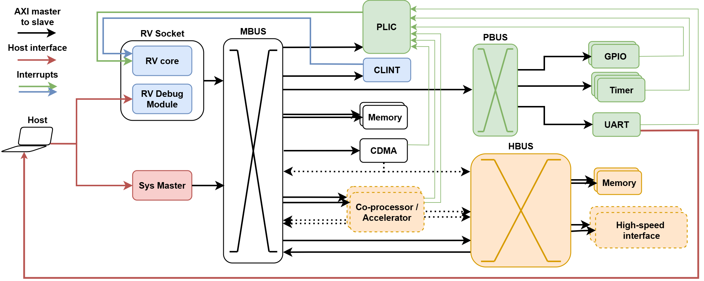

# Basic SoC Generation Architecture

In both `hpc` and `embedded` profiles, a basic SoC architecture and host connection is depicted below:

It features a main bus (MBUS), a peripheral bus (PBUS) for low-speed devices and a high-performance bus (HBUS) for high-bandwidth memory (HBM) accesses, suitable for accelerators and co-processors.
> In the `embedded` profile, the HBUS is disabled by design.

## Host connection
The host connects to:
- a CPU-specific RISC-V debug module or [Xilinx MDM-V](https://docs.amd.com/r/en-US/pg428-mdm-v) for GDB/OpenOCD debug over JTAG, and
- a `Sys Master` AXI master module, allowing for direct control and read-back over the main bus.

## RV Socket
The RV Socket hosts a RISC-V processor (RV core) alongside its compatible Debug Transport Module (DTM), exposed to the host for debugger connection.
The Socket is designed as a uniform AXI4 interface to accommodate different RISC-V CPU implementations, while providing a common abstraction layer that standardizes its connection to the surrounding infrastructure.

The desired CPU can be selected with the `CORE_SELECTOR` configuration parameter, see the [configuration documentation](../config/README.md) for more details.

## Peripherals
Simply-V currently supports the follwing third-party periperals:
- [PLIC](hw/units/custom_rv_plic/) (RISC-V Platform-Level Interrupt Controller): arbitrates interrupts from peripherals to the RV Socket.
- [CLINT](hw/units/custom_clint/) (RISC-V Core Local Interrupt Controller): implements `msip`, `mtime` and `mtimecmp` CSRs and timer and software interrupts to the RV Socket.
- Memories:
   - [BRAM](https://docs.amd.com/v/u/en-US/pg058-blk-mem-gen) on the MBUS
   - [MIG-based DDR4 memory channels](https://docs.amd.com/r/en-US/pg150-ultrascale-memory-ip/) on the MBUS (cached) and HBUS (uncached).
   - [TODO124](https://github.com/HiSA-Team/Simply-V/issues/124): [HBM](https://docs.amd.com/r/en-US/pg276-axi-hbm) on MBUS/HBUS.
- [CDMA (AXI Central DMA IP)](https://docs.amd.com/r/en-US/pg034-axi-cdma) for AXI memory-to-memory transactions.
- On PBUS: a pool of utility IPs from Xilinx, namely [GPIO out and in](https://docs.amd.com/r/en-US/pg144-axi-gpio) (embedded only), [UART](https://docs.amd.com/v/u/en-US/pg142-axi-uartlite) (or [Virtual UART](hw/xilinx/rtl/virtual_uart.sv) for HPC profile)

Additionally, we intergate a high-level synthesis (HLS) [accelerator IP for 2D convolution](hw/units/custom_hls_conv_hbus) on the HBUS, integrated in our custom IP packaging flow.
