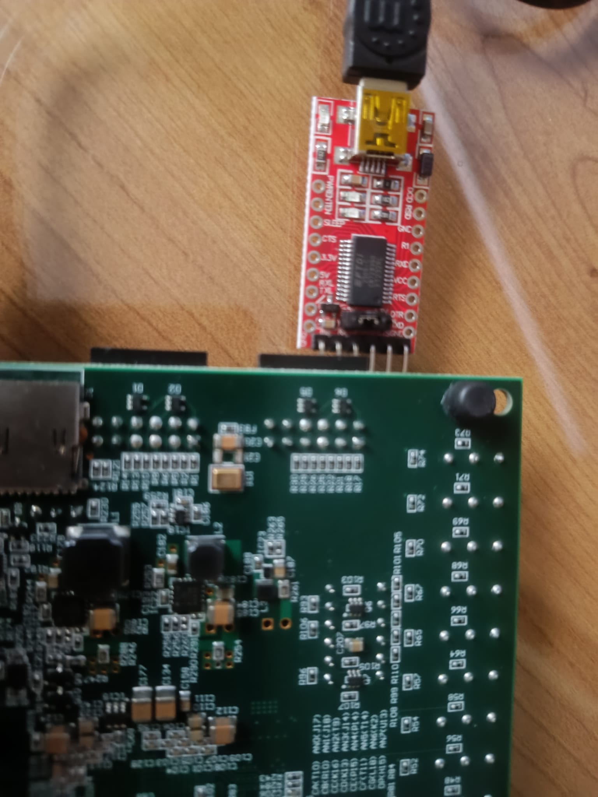

# Uart Connection

The UART peripheral is available in both `hpc` and `embedded` configurations. The `hpc` configuration virtualizes the serial protocol over PCIe, whereas the `embedded` configuration maps the `rx` and `tx` signals to physical output ports. Currently, only Nexys boards are supported for the `embedded` profile. This document outlines how to connect a UART transceiver to Vesuvius.

By default, the UART `rx` and `tx` signals are mapped to PMOD port C, as defined in `hw/synth/constraints/Nexys-A7-*T-Master.xdc`. We use an [FDTI transceiver USB to serial](https://www.amazon.it/APKLVSR-FT232RL-Adattatore-Convertitore-seriale/dp/B0CFFCLF6X) to connect Vesuvius UART to an external terminal via a USB serial connection (see reference picture).

Any compatible device can be used, provided the pins are correctly connected.
You can use any serial terminal application; however, we recommend [Minicom](https://github.com/Distrotech/minicom/tree/master).
In the current implementation, the UART operates at a baud rate of 9600. For further details, refer to `hw/ips/embedded/xlnx_axi_uartlite/config.tcl`.

