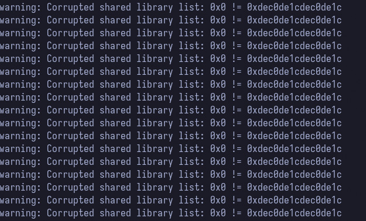

# Troubleshooting


# Corrupted shared library
When running `make run`, if you experience the error shown below, you might want to switch to newlib `gdb`.



This can be achieved by modifying the [platform_run.sh](../simply-v/platform_run.sh) script changing the `gdb` command with the newlib (like shown in the comment above). 
For example:

```sh
# Build GDB command (POSIX sh compatible)
# If you are experiencing mismatch of the opensbi version (this is mostly due to the GLIBC version
# of the Host OS and Server OS incompatibility), you can switch to the newlib gdb version
GDB_CMD="riscv${PLATFORM_RISCV_XLEN}-unknown-elf-gdb -ex 'set confirm off' -ex 'target extended-remote ${GDB_SERVER}'"
# GDB_CMD="${CROSS_COMPILE}gdb -ex 'set confirm off' -ex 'target extended-remote ${GDB_SERVER}'"
```


